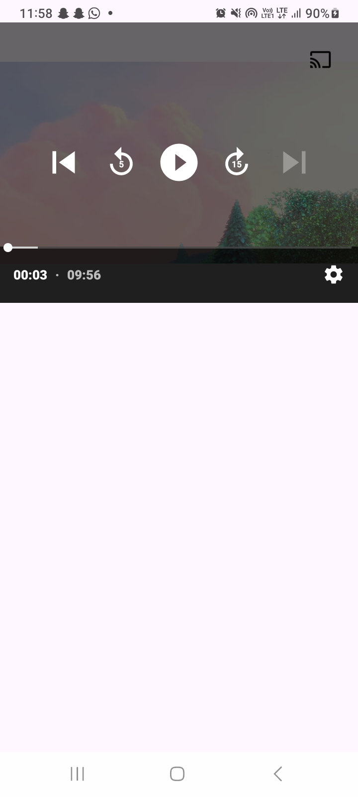
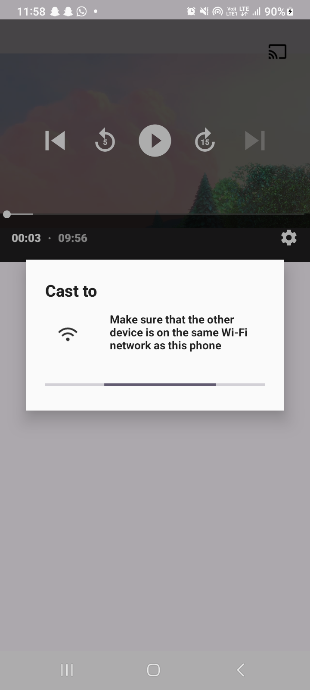
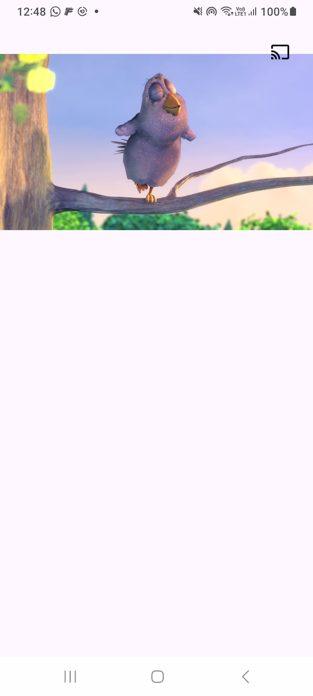

# Cast-App

Cast-App is a versatile media casting application that allows you to easily stream content from your Android device to various casting-enabled devices like Chromecast, smart TVs, and other DLNA/UPnP compatible receivers.

<p align="center">
  <a href="https://f-droid.org/packages/com.samyak.castapp">
    
  </a>
</p>

## Features

- Media casting to Chromecast devices
- Support for DLNA/UPnP compatible receivers
- Video, audio, and image streaming
- Basic media library organization
- Simple and intuitive user interface
- Customizable playback controls

## Screenshots

<p align="center">
  
  
  
</p>

## Installation

### F-Droid

Cast-App is available on F-Droid, the open-source Android app repository:

1. Install [F-Droid](https://f-droid.org/)
2. Search for "Cast-App" in the F-Droid client
3. Install the app

### Manual Installation

You can also download the APK directly from the [Releases](https://github.com/samyak2403/Cast-App/releases) page.

## Building from Source

To build the app from source:

1. Clone the repository:
   ```
   git clone https://github.com/samyak2403/Cast-App.git
   ```

2. Open the project in Android Studio

3. Build the app using Gradle:
   ```
   ./gradlew assembleDebug
   ```

## Privacy

Cast-App respects your privacy:
- No tracking or analytics
- No personal data collection
- No advertisements
- No internet permission except for casting functionality

## Contributing

Contributions are welcome! Please feel free to submit a Pull Request.

1. Fork the repository
2. Create your feature branch (`git checkout -b feature/amazing-feature`)
3. Commit your changes (`git commit -m 'Add some amazing feature'`)
4. Push to the branch (`git push origin feature/amazing-feature`)
5. Open a Pull Request

## License

This project is licensed under the MIT License - see the [LICENSE](LICENSE) file for details.

## Contact

Samyak Kamble - samyakkamble6659@gmail.com

Project Link: [https://github.com/samyak2403/Cast-App](https://github.com/samyak2403/Cast-App)
